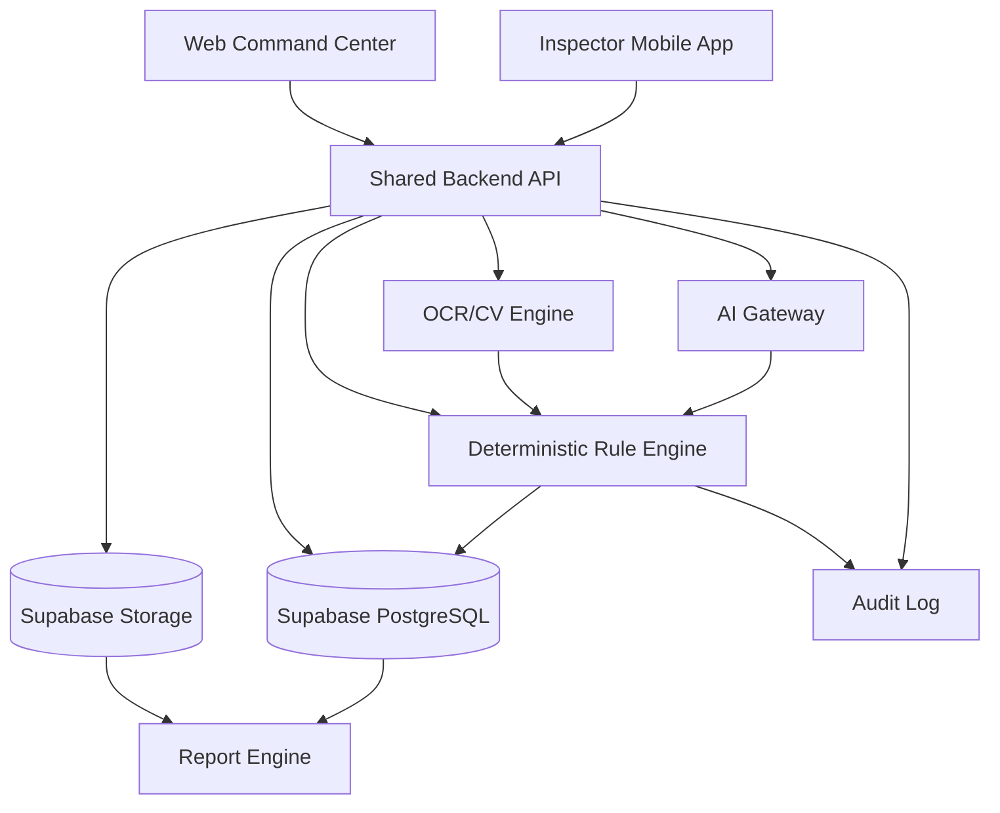
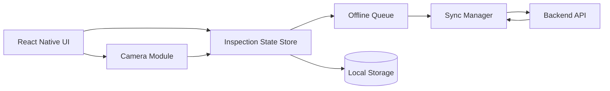
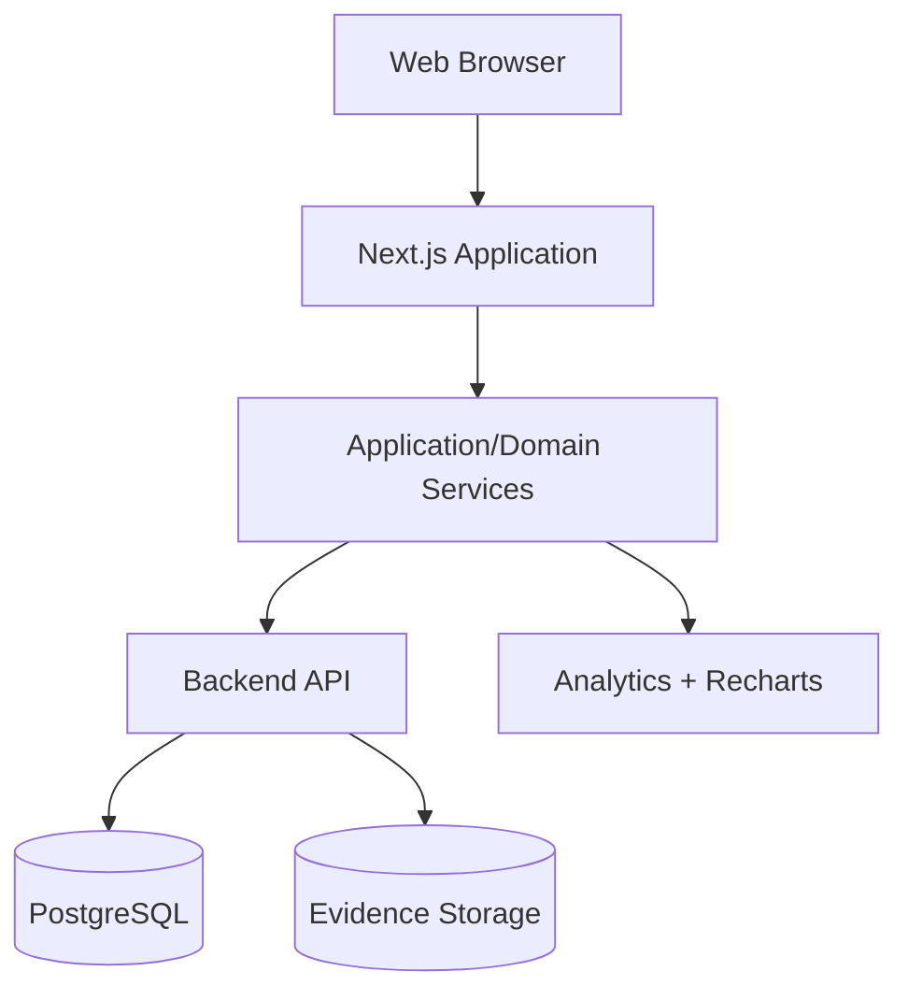
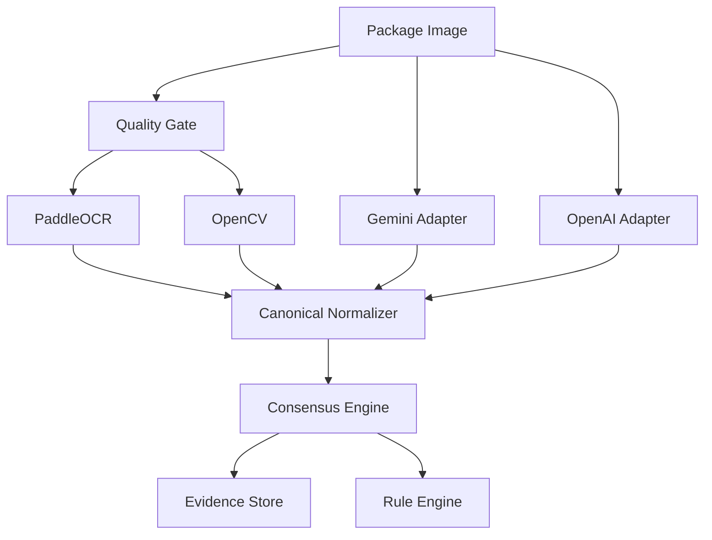
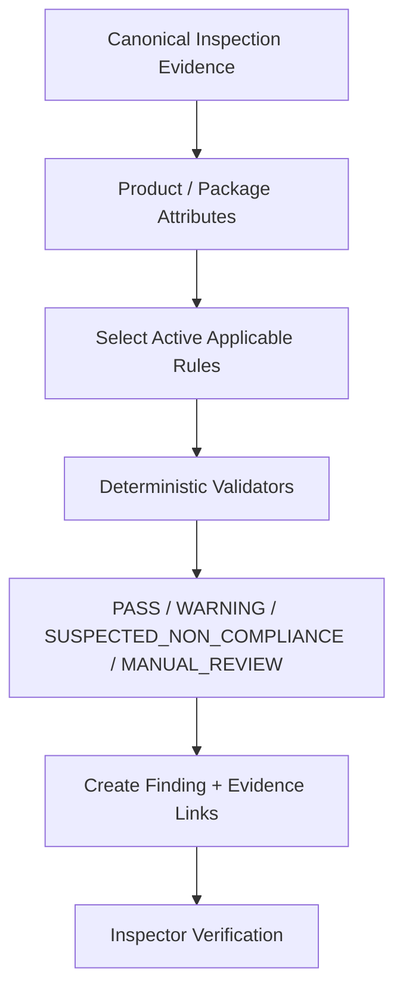
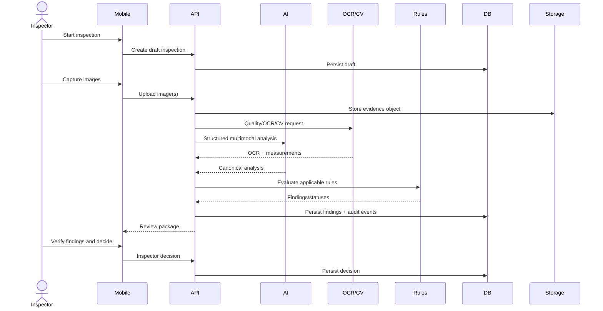
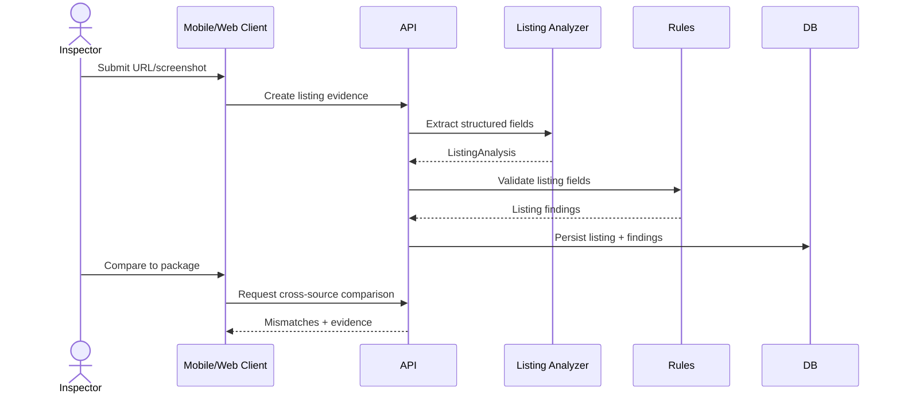
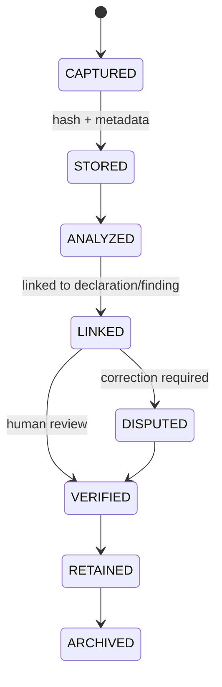
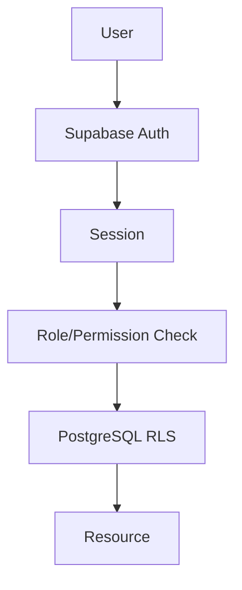
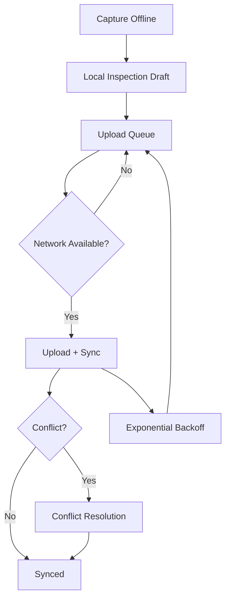

# LM-Vision — System Architecture

## 1. Architecture Overview

### Architecture principles

- Clients never decide legal outcomes.
- AI and CV provide evidence/measurements.
- Rule engine is deterministic and versioned.
- Human verification is a first-class domain object.
- Storage and database are separated but cryptographically linked by evidence hashes.

## 2. Mobile Architecture

## 3. Web Architecture

## 4. AI Pipeline

## 5. Rule Engine Flow

## 6. Physical Inspection Sequence

## 7. E-Commerce Sequence

## 8. Evidence Lifecycle

## 9. Authentication/RBAC

Authorization must be enforced server-side and at the database layer for protected records.

## 10. Offline Sync

## Architecture boundaries

**AI boundary:** structured extraction/interpretation only.  
**Rule boundary:** accepts canonical evidence and active rules; emits deterministic validation results.  
**Evidence boundary:** owns binary evidence, hashes, provenance, retention metadata.  
**Decision boundary:** only human decision can finalize inspection outcome.
