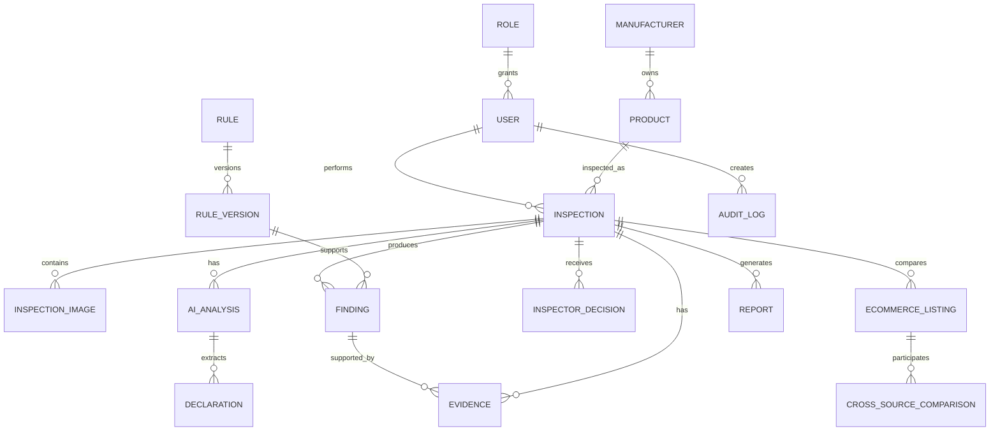

# LM-Vision — Database Design

## 1. Logical ER Diagram



## 2. Common conventions

- IDs: UUID.
- Timestamps: `timestamptz` in UTC.
- JSON: `jsonb` for structured external/provider payloads only when a stable relational projection is not necessary.
- Soft deletion: prefer status/archive over physical deletion for inspection/evidence records.
- All mutable business entities have `created_at`, `updated_at`; sensitive history uses audit events rather than overwriting provenance.

## 3. Table Definitions

### `roles`

| Column | Type | Key | Notes |
|---|---|---|---|
| id | uuid | PK | Role ID |
| name | text | UNIQUE | `INSPECTOR`, `SUPERVISOR`, `ADMIN`, `AUDITOR` |
| description | text | | |
| created_at | timestamptz | | |

### `users`

| Column | Type | Key | Notes |
|---|---|---|---|
| id | uuid | PK/FK | Matches auth user ID |
| role_id | uuid | FK roles.id | |
| full_name | text | | |
| employee_code | text | INDEX | Operational identifier if policy allows |
| is_active | boolean | | |
| created_at | timestamptz | | |
| updated_at | timestamptz | | |

### `manufacturers`

| Column | Type | Key | Notes |
|---|---|---|---|
| id | uuid | PK | |
| legal_name | text | INDEX | Canonical display name |
| aliases | text[] | | Search aliases |
| contact_metadata | jsonb | | Non-sensitive business metadata |
| created_at | timestamptz | | |
| updated_at | timestamptz | | |

### `products`

| Column | Type | Key | Notes |
|---|---|---|---|
| id | uuid | PK | |
| manufacturer_id | uuid | FK | |
| name | text | INDEX | Generic/canonical product name |
| category | text | INDEX | Product classification |
| package_type | text | | |
| metadata | jsonb | | Product attributes |
| created_at | timestamptz | | |
| updated_at | timestamptz | | |

### `inspections`

| Column | Type | Key | Notes |
|---|---|---|---|
| id | uuid | PK | |
| inspector_id | uuid | FK users.id | |
| product_id | uuid | FK products.id | Nullable until classification |
| status | text | INDEX | Workflow status |
| source_type | text | | `PHYSICAL`, `ECOMMERCE`, `HYBRID` |
| location_metadata | jsonb | | Coarse operational location if permitted |
| started_at | timestamptz | INDEX | |
| completed_at | timestamptz | | |
| rule_version_context | jsonb | | Snapshot of rule versions used |
| created_at | timestamptz | | |
| updated_at | timestamptz | | |

### `inspection_images`

| Column | Type | Key | Notes |
|---|---|---|---|
| id | uuid | PK | |
| inspection_id | uuid | FK | |
| storage_path | text | UNIQUE | Object path |
| sha256 | text | INDEX | Integrity hash |
| mime_type | text | | Allowlisted image MIME |
| width | int | | |
| height | int | | |
| capture_metadata | jsonb | | Device/capture metadata allowed by policy |
| quality_score | numeric | | |
| created_at | timestamptz | | |

### `ai_analyses`

| Column | Type | Key | Notes |
|---|---|---|---|
| id | uuid | PK | |
| inspection_id | uuid | FK | |
| provider | text | | |
| model | text | | |
| schema_version | text | | |
| status | text | | |
| confidence | numeric | | 0..1 |
| payload | jsonb | | Canonical/provider audit payload |
| created_at | timestamptz | | |

### `declarations`

| Column | Type | Key | Notes |
|---|---|---|---|
| id | uuid | PK | |
| inspection_id | uuid | FK | |
| ai_analysis_id | uuid | FK | |
| field_name | text | INDEX | Canonical field key |
| raw_value | text | | As observed/extracted |
| normalized_value | jsonb | | Parsed value/unit |
| confidence | numeric | | |
| verification_status | text | | `UNVERIFIED`, `VERIFIED`, `REJECTED` |
| evidence_refs | uuid[] | | Links to evidence |
| created_at | timestamptz | | |
| updated_at | timestamptz | | |

### `rules`

| Column | Type | Key | Notes |
|---|---|---|---|
| id | uuid | PK | Stable logical rule ID |
| rule_number | text | INDEX | Source numbering |
| sub_rule | text | | |
| title | text | | |
| category | text | INDEX | Declaration/quantity/etc. |
| created_at | timestamptz | | |

### `rule_versions`

| Column | Type | Key | Notes |
|---|---|---|---|
| id | uuid | PK | |
| rule_id | uuid | FK | |
| version | text | | |
| applicability | jsonb | | Executable predicate data |
| conditions | jsonb | | |
| requirement | jsonb | | |
| validation_type | text | | |
| threshold | jsonb | | |
| exceptions | jsonb | | |
| effective_from | date | INDEX | |
| effective_to | date | | |
| source_document | text | | |
| source_page | text | | Required for activation |
| approval_status | text | INDEX | |
| approved_by | uuid | FK users.id | |
| approved_at | timestamptz | | |
| created_at | timestamptz | | |

### `findings`

| Column | Type | Key | Notes |
|---|---|---|---|
| id | uuid | PK | |
| inspection_id | uuid | FK | |
| rule_version_id | uuid | FK | Nullable only for non-legal observation |
| finding_type | text | INDEX | |
| status | text | INDEX | Four canonical statuses |
| title | text | | |
| explanation | text | | Evidence-backed explanation |
| confidence | numeric | | AI/CV confidence where applicable |
| human_review_required | boolean | INDEX | |
| created_at | timestamptz | | |
| updated_at | timestamptz | | |

### `evidence`

| Column | Type | Key | Notes |
|---|---|---|---|
| id | uuid | PK | |
| inspection_id | uuid | FK | |
| evidence_type | text | INDEX | IMAGE, OCR_REGION, LISTING, NOTE, MEASUREMENT, etc. |
| storage_path | text | | Nullable for structured-only evidence |
| sha256 | text | INDEX | |
| source_reference | jsonb | | Image/page/region/provider reference |
| captured_at | timestamptz | | |
| verified_by | uuid | FK users.id | |
| verified_at | timestamptz | | |
| created_at | timestamptz | | |

### `inspector_decisions`

| Column | Type | Key | Notes |
|---|---|---|---|
| id | uuid | PK | |
| inspection_id | uuid | FK | |
| inspector_id | uuid | FK users.id | |
| decision | text | | Domain decision enum |
| comments | text | | |
| decided_at | timestamptz | | |

### `ecommerce_listings`

| Column | Type | Key | Notes |
|---|---|---|---|
| id | uuid | PK | |
| inspection_id | uuid | FK | |
| source_url | text | | |
| captured_at | timestamptz | | Retrieval timestamp |
| merchant_name | text | | |
| fields | jsonb | | Structured listing fields |
| screenshot_evidence_id | uuid | FK evidence.id | |
| analysis_status | text | | |

### `cross_source_comparisons`

| Column | Type | Key | Notes |
|---|---|---|---|
| id | uuid | PK | |
| inspection_id | uuid | FK | |
| listing_id | uuid | FK | |
| comparison | jsonb | | Field-by-field comparison |
| status | text | | MATCH/MISMATCH/UNKNOWN |
| created_at | timestamptz | | |

### `reports`

| Column | Type | Key | Notes |
|---|---|---|---|
| id | uuid | PK | |
| inspection_id | uuid | FK | |
| format | text | | PDF/HTML |
| storage_path | text | | |
| sha256 | text | | |
| generated_by | uuid | FK users.id | |
| generated_at | timestamptz | | |

### `audit_logs`

| Column | Type | Key | Notes |
|---|---|---|---|
| id | uuid | PK | |
| actor_user_id | uuid | FK users.id | Nullable for system events |
| action | text | INDEX | |
| entity_type | text | INDEX | |
| entity_id | uuid | INDEX | |
| before_data | jsonb | | Redacted as required |
| after_data | jsonb | | Redacted as required |
| metadata | jsonb | | request/correlation ID |
| created_at | timestamptz | INDEX | |

## 4. Indexes

Minimum indexes:

```sql
create index idx_inspections_status_started on inspections(status, started_at desc);
create index idx_inspections_product on inspections(product_id, started_at desc);
create index idx_findings_status on findings(status, human_review_required);
create index idx_rules_rule_number on rules(rule_number);
create index idx_rule_versions_effective on rule_versions(effective_from, effective_to, approval_status);
create index idx_evidence_hash on evidence(sha256);
create index idx_audit_entity on audit_logs(entity_type, entity_id, created_at desc);
```

## 5. Constraints

- Confidence values must be between 0 and 1.
- `rule_versions.approval_status='ACTIVE'` requires populated source fields and `approved_by/approved_at`.
- `findings.rule_version_id` is mandatory for findings claimed as legal-rule results.
- A report cannot be final if the inspection has unresolved mandatory `MANUAL_REVIEW` findings unless the product explicitly records an authorized override path.
- Evidence hashes are immutable after creation.

## 6. RLS Strategy

Principles:

- Inspectors access their assigned/owned inspections and permitted evidence.
- Supervisors access their organizational scope.
- Admins manage configuration and users.
- Auditors have read-only access to permitted inspection/audit resources.
- Storage object access mirrors the database authorization boundary.

RLS should use server-issued claims/role mapping and avoid trusting a client-submitted role field.

## 7. Audit Strategy

Audit events must capture authentication/security events, inspection creation/decision changes, evidence verification, rule lifecycle changes, report generation, role changes, and privileged configuration edits.

Do not store provider API secrets or unnecessary sensitive payloads in the audit log. Store hashes/references when the full payload is already retained elsewhere.
