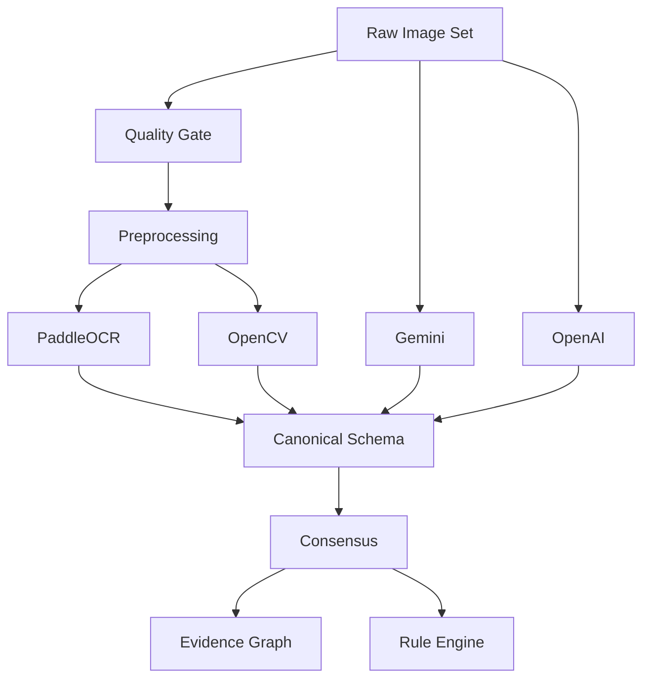

# LM-Vision — AI / Computer Vision Architecture

## 1. Responsibility Matrix

| Component | Responsibility | Must not do |
|---|---|---|
| Gemini | Multimodal extraction/classification/explanation adapter | Final legal decision |
| OpenAI | Alternate multimodal extraction/classification/explanation adapter | Final legal decision |
| PaddleOCR | OCR text and regions | Legal interpretation |
| OpenCV | Quality, geometry, contrast, perspective, measurement support | Claim compliance without rule evaluation |
| Consensus Engine | Compare structured provider outputs | Invent a third answer without evidence |
| Rule Engine | Deterministic applicability/validation | Generate rules from model prose |

## 2. Processing Pipeline



## 3. Canonical Schemas

### `TextRegion`

```ts
export interface TextRegion {
  id: string;
  imageId: string;
  text: string;
  bbox: { x: number; y: number; width: number; height: number };
  confidence: number;
  source: 'OCR' | 'VISION_MODEL';
}
```

### `Declaration`

```ts
export interface Declaration {
  id: string;
  field:
    | 'manufacturer'
    | 'packer'
    | 'importer'
    | 'commodity_name'
    | 'net_quantity'
    | 'date'
    | 'mrp'
    | 'consumer_care'
    | 'dimensions'
    | 'unit'
    | 'language'
    | 'other';
  rawValue: string;
  normalizedValue?: unknown;
  confidence: number;
  textRegionIds: string[];
  evidenceIds: string[];
  verificationStatus: 'UNVERIFIED' | 'VERIFIED' | 'REJECTED';
}
```

### `ImageQuality`

```ts
export interface ImageQuality {
  blurScore: number;
  glareScore: number;
  exposureScore: number;
  occlusionScore: number;
  overall: number;
  recommendations: string[];
  pass: boolean;
}
```

### `VisualMeasurement`

```ts
export interface VisualMeasurement {
  measurementType: string;
  value?: number;
  unit?: string;
  method: string;
  confidence: number;
  isEstimated: boolean;
  calibrationId?: string;
  evidenceIds: string[];
}
```

### `PackageAnalysis`

```ts
export interface PackageAnalysis {
  schemaVersion: string;
  provider: string;
  model: string;
  declarations: Declaration[];
  textRegions: TextRegion[];
  imageQuality: ImageQuality[];
  visualMeasurements: VisualMeasurement[];
  classification: {
    category?: string;
    packageType?: string;
    confidence: number;
  };
  uncertainties: { field: string; reason: string; confidence: number }[];
}
```

### `ListingAnalysis`

```ts
export interface ListingAnalysis {
  schemaVersion: string;
  sourceUrl?: string;
  merchant?: string;
  fields: Declaration[];
  screenshotEvidenceIds: string[];
  retrievalTimestamp: string;
  uncertainties: string[];
}
```

## 4. Confidence Handling

Suggested bands are configuration, not legal thresholds:

| Confidence | System behavior |
|---|---|
| `>= 0.90` | Accept as machine-extracted candidate; retain evidence and permit review. |
| `0.70–0.89` | Flag for contextual review when field affects rule applicability. |
| `< 0.70` | Prefer `MANUAL_REVIEW`; do not silently drive critical rule checks. |

Confidence must be calibrated empirically on a project dataset. Thresholds are not asserted as legal standards.

## 5. Provider Fallback

Order is configuration-driven. Recommended demo policy:

1. Primary live provider.
2. Alternate provider when configured.
3. `MockProvider` for deterministic demo flows.
4. Manual review when no reliable machine result is available.

Provider responses must be validated against the canonical schema before entering the domain layer.

## 6. Consensus

Compare critical fields such as MRP, net quantity, manufacturer, date, and product classification using normalized representations.

Example:

```json
{
  "field": "mrp",
  "gemini": {"value": 249, "confidence": 0.97},
  "openai": {"value": 249, "confidence": 0.94},
  "consensus": {"status": "AGREED", "value": 249, "confidence": 0.95}
}
```

Disagreement example:

```json
{
  "field": "mrp",
  "gemini": {"value": 249, "confidence": 0.93},
  "openai": {"value": 299, "confidence": 0.91},
  "consensus": {"status": "CONFLICT", "humanReviewRequired": true}
}
```

## 7. Low-Confidence Behavior

- Preserve the raw evidence.
- Preserve the model output.
- Mark the field uncertain.
- Block dependent legal checks where the value is material.
- Route to human verification.
- Never convert missing/uncertain evidence to PASS.

## 8. Cost/Latency Controls

- Compress images before upload where evidentiary quality remains sufficient.
- Crop regions before expensive multimodal calls.
- Cache deterministic transforms.
- Avoid sending the same full-resolution image repeatedly.
- Batch independent requests when supported.
- Use mock fixtures during development/tests.
