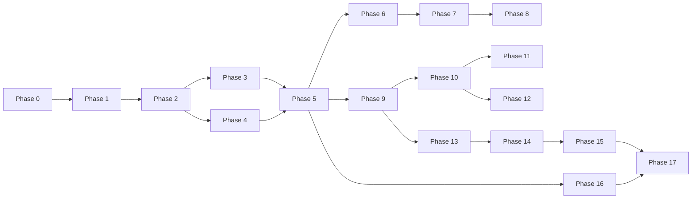

# LM-Vision — Implementation Roadmap

## Phase 0 — Planning / Documentation

**Goal:** freeze architecture and source boundaries.  
**Dependencies:** none.  
**Deliverables:** docs, ADRs, domain glossary, source-gating process.  
**Acceptance:** all requested documents reviewed; legal source ingestion blocked until authoritative PDF is available.  
**Risks:** scope creep → use MVP table and architecture constraints.

## Phase 1 — Monorepo + Shared Types

**Goal:** establish repository and canonical contracts.  
**Dependencies:** Phase 0.  
**Deliverables:** apps/services/packages layout, TypeScript schemas, lint/test config.  
**Acceptance:** mobile/web can import shared inspection types.  
**Risks:** duplicated types → single source of truth in shared packages.

## Phase 2 — Supabase + Authentication

**Goal:** database/Auth/Storage/RLS baseline.  
**Dependencies:** Phase 1.  
**Deliverables:** migrations, roles, RLS, private buckets, seed.  
**Acceptance:** role-based test suite passes.  
**Risks:** weak RLS → automated authorization tests.

## Phase 3 — Mobile Shell

**Goal:** field workflow shell.  
**Dependencies:** Phase 2.  
**Deliverables:** navigation, inspection draft, camera flow, local state.  
**Acceptance:** offline draft/capture can be completed.  
**Risks:** UX complexity → field-first task flow.

## Phase 4 — Web Shell

**Goal:** command center.  
**Dependencies:** Phase 2.  
**Deliverables:** dashboard, inspections, detail, history.  
**Acceptance:** seeded cases visible and searchable.

## Phase 5 — Complete Mock AI Workflow

**Goal:** end-to-end demo without external providers.  
**Dependencies:** Phases 3–4.  
**Deliverables:** MockProvider, mock OCR/CV fixtures, findings/evidence path.  
**Acceptance:** flagship demo runs with network disabled for providers.  
**Risks:** fixture drift → version fixtures and schema tests.

## Phase 6 — Gemini

**Goal:** live multimodal provider adapter.  
**Dependencies:** Phase 5.  
**Deliverables:** server-side adapter + schema mapping + safety controls.  
**Acceptance:** benchmark corpus meets agreed extraction metrics.  
**Risks:** provider changes → adapter isolation.

## Phase 7 — OpenAI

**Goal:** second provider.  
**Dependencies:** Phase 6.  
**Deliverables:** adapter + benchmark comparison.  
**Acceptance:** same canonical schema; no domain code imports provider SDK.

## Phase 8 — AI Consensus

**Goal:** structured field-level disagreement handling.  
**Dependencies:** Phases 6–7.  
**Deliverables:** consensus engine, conflict UI/status.  
**Acceptance:** disagreement reliably creates manual review.

## Phase 9 — Rule Engine

**Goal:** source-backed deterministic validation.  
**Dependencies:** Phase 5 schemas + authoritative Rules PDF.  
**Deliverables:** rule model, versioning, validators, rule tests.  
**Acceptance:** every active rule has source metadata + positive/negative tests.  
**Risks:** legal misinterpretation → human/legal review gate.

## Phase 10 — OCR/OpenCV

**Goal:** replace mock extraction/measurement with real engines.  
**Dependencies:** Phase 9 schemas.  
**Deliverables:** PaddleOCR pipeline, preprocessing, CV modules.  
**Acceptance:** benchmark dataset and error metrics documented.

## Phase 11 — Calibration

**Goal:** reference-object physical estimates.  
**Dependencies:** Phase 10.  
**Deliverables:** capture UX + measurement service + confidence.

## Phase 12 — E-commerce

**Goal:** digital listing analysis and cross-source comparison.  
**Dependencies:** Phases 5–10.  
**Deliverables:** URL/screenshot intake, listing schema, comparison engine.

## Phase 13 — Evidence + Human Verification

**Goal:** robust evidence chain and review workflow.  
**Dependencies:** core inspection/findings.  
**Deliverables:** evidence graph, verification audit, signed access.

## Phase 14 — Reports

**Goal:** production-quality PDF.  
**Dependencies:** evidence + decision workflow.  
**Deliverables:** report template and snapshot semantics.

## Phase 15 — Analytics

**Goal:** dashboard metrics and manufacturer/risk views.  
**Dependencies:** enough seeded/historical data.  
**Deliverables:** aggregates, filters, charts.

## Phase 16 — Offline Sync

**Goal:** reliable intermittent-network operation.  
**Dependencies:** mobile local state + API idempotency.  
**Deliverables:** queue, retry, conflict resolution, sync UI.

## Phase 17 — QA

**Goal:** release readiness.  
**Dependencies:** all above.  
**Deliverables:** full test matrix, security tests, demo rehearsal, performance report.  
**Acceptance:** all P0 acceptance gates pass.

## Dependency Snapshot

## Definition of Done

A phase is complete only when code, schema/contracts, automated tests, documentation updates, and acceptance evidence are all present. No phase may silently redefine the canonical inspection model.
